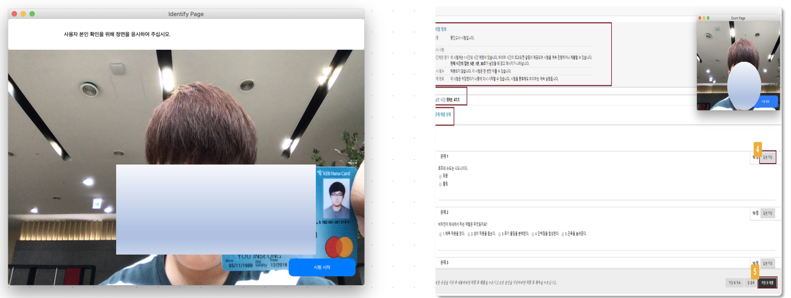

# POOC (Prevent Online & Offline Cheating)
> 영상처리 기반 온라인 시험 부정행위 방지 프로그램

**2020 인하대학교 컴퓨터공학과 프로그래밍 공모전 대상 수상작 :1st_place_medal:**

## :open_book: Introduction
코로나 19의 확산으로 '언택트' 문화가 널리 퍼짐에 따라 많은 곳에서 온라인 시험을 진행하였습니다. 하지만 온라인 시험에는 모두가 알다시피 컨닝, 집단시험 등과 같은 치명적인 문제점이 있습니다. 그러나 아직 대부분이 부정행위 방지를 위한 확실한 대책이나 온라인 시험 진행을 위한 명확한 메뉴얼이 마련되어 있지 않았습니다.
프로그래밍 공모전 주제 였던 '언택트'와 관련지어 이러한 문제점을 영상 처리를 통한 부정행위를 분석하는 방법을 통해 해결해보고자 하였습니다.

## :computer: Techs

  ### [OpenCV-Python](https://github.com/skvark/opencv-python)
  - opencv-python 라이브러리를 사용하여 전체적인 영상 처리 기능들을 구현하였습니다. 주로 같이 쓰이는 shape 68 landmarks data를 이용하였습니다. 핵심 기능 중 하나인 시험자의 시선 판별은 눈동자의 위치 감지 후 눈동자에 해당하는 범위의 RGB를 분석하여 검은자의 위치를 판정하는 로직으로 구현하였습니다.

  ### [Face Recognition library](https://github.com/ageitgey/face_recognition)
  - face recognition 라이브러리를 사용하여 얼굴 인식을 통한 본인 확인을 구현하였습니다. 로컬에 저장된 학생의 사진과 캠에 비춘 학생증, 본인의 얼굴을 대조하여 동일 인물인지를 판별합니다. 
  - 각 frame 마다 face encodings의 return 으로 받아온 Array 형식의 데이터에서, Array의 length를 통해 자리를 비우거나 캠에 두 명 이상 잡히는 여부를 판정하였습니다.

  ### [Keyboard event hook](https://github.com/boppreh/keyboard)
  - 'keyboard' 라이브러리를 사용하여 시험 도중 alt, tab 키 등등 의심이 될 만한 특수키 입력을 감지하도록 하였습니다.

  ### [PyQt5](https://www.riverbankcomputing.com/software/pyqt/)
  - openCV-python 및 각종 라이브러리 사용 환경과의 통일 및 응용 프로그램으로 존재해야 한다는 특징 등을 고려하여, UI 구현 framework로 PyQt를 채용하였습니다.
  
## 📸 ScreenShot



## 🧑🏻‍💻 Collaborator
```
유인성 (You In Seong)
https://github.com/Ro4z
insung1217@gmail.com

최지민 (Choi Ji Min)
https://github.com/Jella-Choi
ewqazxc319@gmail.com
